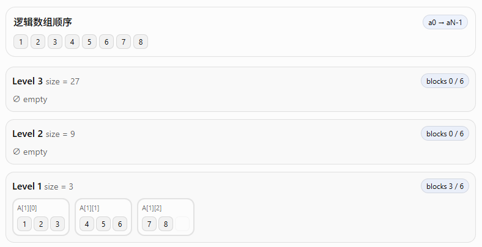
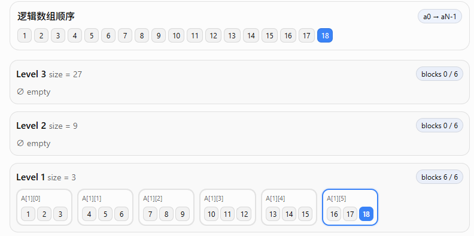
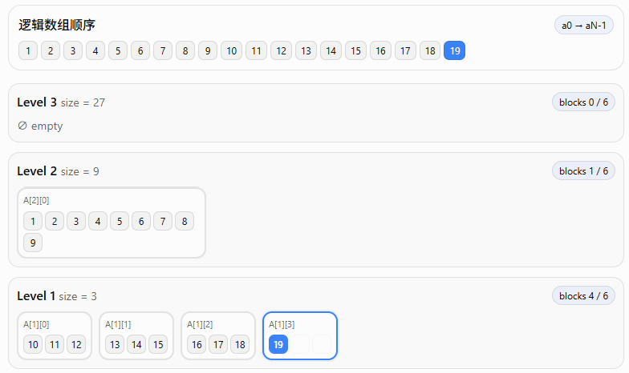
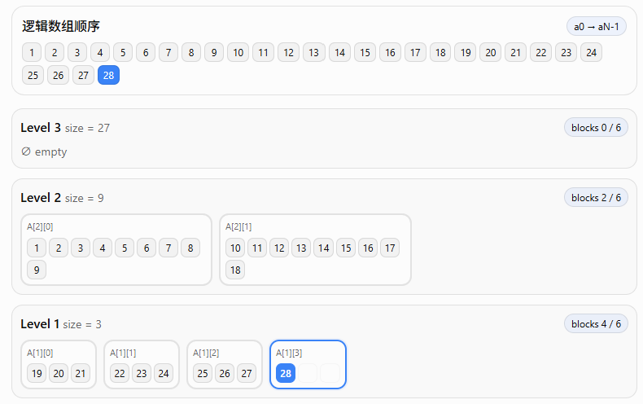
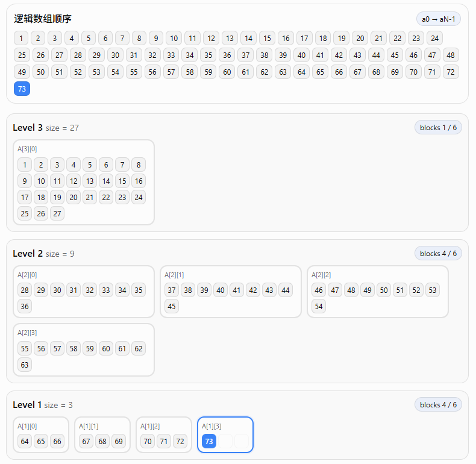
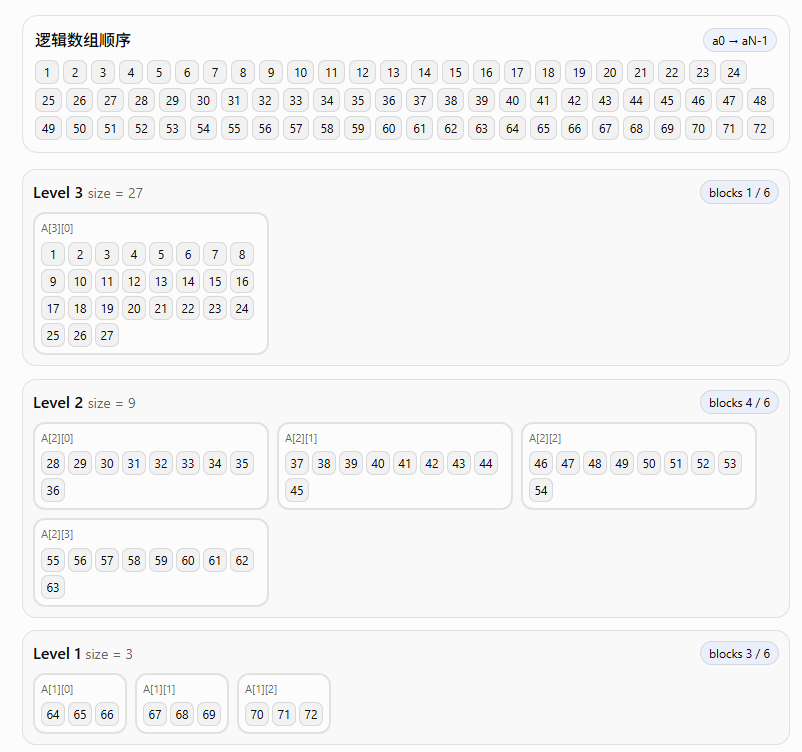
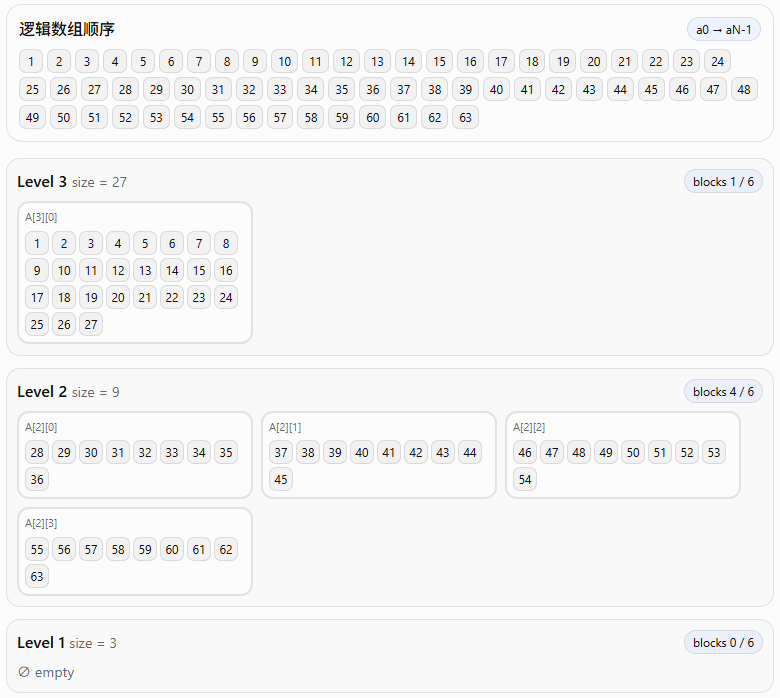
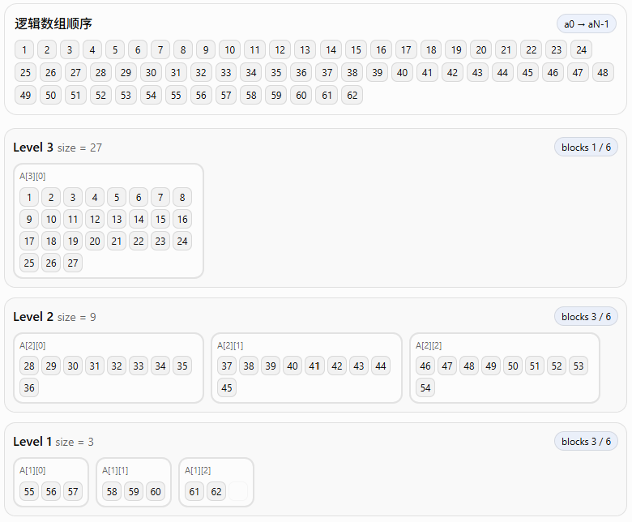

# 直观演示

>说明：这里是使用的ChatGPT 5.6 Sol生成的一个小程序进行数据可视化，仅程序部分使用AI生成

我们首先回忆该数据结构：Resizable Arrays

支持几种操作

- grow：在数组末尾增加元素
- shrink：在数组末尾减少元素
- access / modify：随机访问（访问时间O(1)）

使用分层、分块结构存储

我们假设参数为：r = 4, B = 3，也就是每个层最多有 2B = 6 个块，每个块大小为该层的幂次

## Grow & Access

首先插入 1 - 8，此时最底层 level 1始终没有满，所以不会向上合并，直接插入第一层即可

随后一直插入，直到将最底层填满，此时填入18个元素

此时如果再添加一个元素，因为level 1已满，所以会触发向上合并操作，合并 level 1 的前B个块（也就是旧块，之所以合并旧的，是因为新的可能后面会频繁修改，如果每层 B 个块直接合并所有，会造成抖动，新元素不断在 level 1 和 level 2跳跃，这是其中一个设计思想）

继续插入，直到插入了28，此时 level 1又满了，所以再次触发向上合并操作，10-18被合并到上层

当我们插入足够多元素，level 2 也满了的时候，就再次向上合并

看到上图，我们可以观察一下，首先想一下每层有几个块，这个块的变化是不是非常类似 extend base-B 进制数，所以整体块的变化是遵循这个规律的

其次，我们再看一下其中某个元素，比如 40 号元素，看到它的前面（上层或者同层前面），所有数都要比它小，后面都要比它大，这其实是因为我们每次都在数组末尾进行插入或者删除

当然，从底向上看，比如从 73 到 40 号元素，你可以看到其实它们也是遵循 extend base-B 规律的，所以这给了我们定位某个元素的**启发**： 先近似使用 base B 高效（O(1)）确定该元素可能在哪一层之上（也就是排除大部分低层），然后通过扫描该层之上，直到第一个非零层（这可以直接使用最低有效位算法（O(1)）得到，论文详细证明了为什么该元素就位于该区间内。这样我们就找到了某个元素的层，至于偏移量，可以使用包含该层的更低层的元素个数减去该元素后面的元素个数（下标可得）

## Shrink

继续，我们首先删除73号元素，因为它在最底层，可以直接删除，接着继续删

直到最底层没有元素，此时无法继续删除，我们要进行向下拆分操作

拆分的原则是，拆分最低非空层的最新块，那么如何找到最低非空层？可见论文正文，具体来说，这和 base B 机制也有关系。

